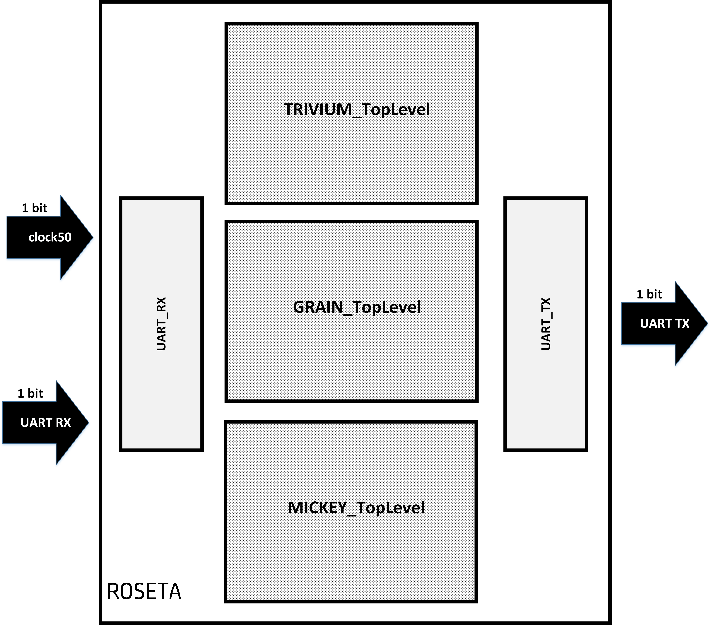
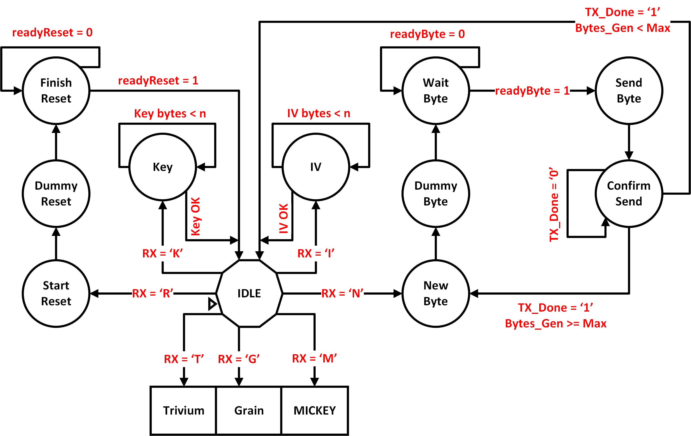
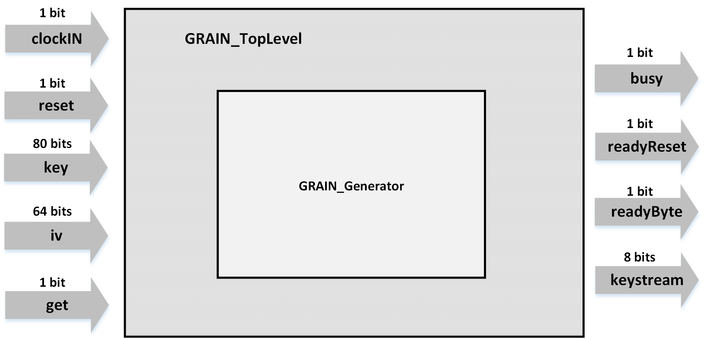
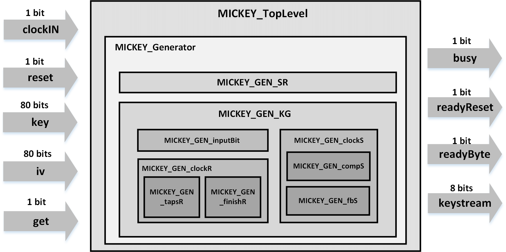

# Analysis scripts

Folder where the source codes for the FPGA hardware description are located. The hardware developed has the function of generating keystream from one of the three systems provided in the perfill II of the eSTREAM project, namely: Trivium, Grain v1 and MICKEY 2.0.
The configuration of the parameters and the choice of which system will be used is performed through serial communication with the analysis platform implemented in Matlab.

## Folder structure

This folder is ordained as follows

* **ModelSim OK:** implementations validated in the Altera ModelSim tool, with keystream results validated with the software implementations made available by the authors (http://www.ecrypt.eu.org/stream/) e no site "A security site" (https://asecuritysite.com/encryption/)

* **Synthesis OK:** implementations after synthesis in the DE2 prototyping platform. The operation was correct, but the simulation presented erroneous values, unlike the test done with serial communication with the analysis platform implemented in Matlab.

## Hardware structure

This hardware system is composed of the following subsystems:

### **ROSETA** 

The three cryptographic systems were developed in FPGA, in addition to a hardware controller for this serial interface with the software analysis platform. The schematic of the system (ROSETA) is shown on the side, its interface consists of a clock pin, a pin for reception and another for serial transmission. The operation of this hardware is based on state machines. The definition of the functions that must be performed by it is specified by sending ASCII characters to the FPGA via interface would be, using the script in Matlab:

  - **T:** selects the Trivium generator;
  - **G:** selects the Grain generator;
  - **M:** selects the MICKEY generator;
  - **K:** initiates  sending process of the encryption key;
  - **I:** initiates sending process of the initialization vector (IV);
  - **R:** requests the circuit reset.
  - **N:** requests the generation of 76,800 pseudorandom bits.

  

---

### **TRIVIUM** 

Hardware that represents the TRIVIUM encryption system, it consists of two blocks: 

- **TopLevel:** is the main module for generator control, it is responsible for the reset and initialization process. In addition, it is through this that the request of generation of pseudorandom bits to the generator module "TRIVIUM_Generator" occurs.

- **Generator:** this module is in fact responsible for keystream generation. At each clock cycle a bit is generated and sent to the "TRIVIUM_TopLevel" module.
  
---
  
### **Grain v1** 
 
Hardware that represents the Grain v1 encryption system, it consists of two blocks: 

- **TopLevel:** the main module for controlling the generator is responsible for the reset and initialization process. In addition, it is through this that the request of generation of pseudorandom bits to the generator module "GRAIN_Generator" occurs.

- **Generator:** this module is in fact responsible for keystream generation. At each clock cycle a bit is generated and sent to the module "GRAIN_TopLevel".
  
---

### **MICKEY 2.0** 
 
Hardware that represents the MICKEY 2.0 encryption system, it consists of the blocks:

- **TopLevel:** the main module for controlling the generator is responsible for the reset and initialization process. In addition, it is through this that the request of generation of pseudorandom bits to the generator module "MICKEY_Generator" occurs.

- **Generator:** this module is in fact responsible for keystream generation. At each clock cycle a bit is generated and sent to the TopLevel module. This generated bit comes from the XOR operation between the bits of position "0" of the registers "R" and "S".

- **GEN_SR:** module responsible for updating the "S" and "R" vectors presented in the description of the MICKEY system.

- **GEN_clockKG:** responsible for calculating the value of the control signals "CONTROL_BIT_R" and "CONTROL_BIT_S", in addition to managing the components "InputBit", "clockR" and "clockS".

- **GEN_inputBit:** responsible for setting the values of the "INPUT_BIT_R" and "INPUT_BIT_S" signals.

- **GEN_clockR**: calculates the value of the "FEEDBACK_BIT" signal for the "R" register, in addition to coordinating the "tapsR" and "finishR" components.

- **GEN_tapsR:** defines the register "R" already with the preset taps.

- **GEN_finishR:** gera o valor de saída definitivo do registrador “R”.

- **GEN_clockS:** calculates the value of the "FEEDBACK_BIT" signal to the "S" register, in addition to coordinating the "compS" and "fbS" components.

- **GEN_compS:** stores the values of the "COMP0" and "COMP1" vectors to calculate the intermediate value of the "S" register.

- **GEN_fbS:** stores the values of the "FB0" and "FB1" vectors, so that together with the calculated intermediate value in the component "GEN_compS", it generates definitive output value of the "S" register.
