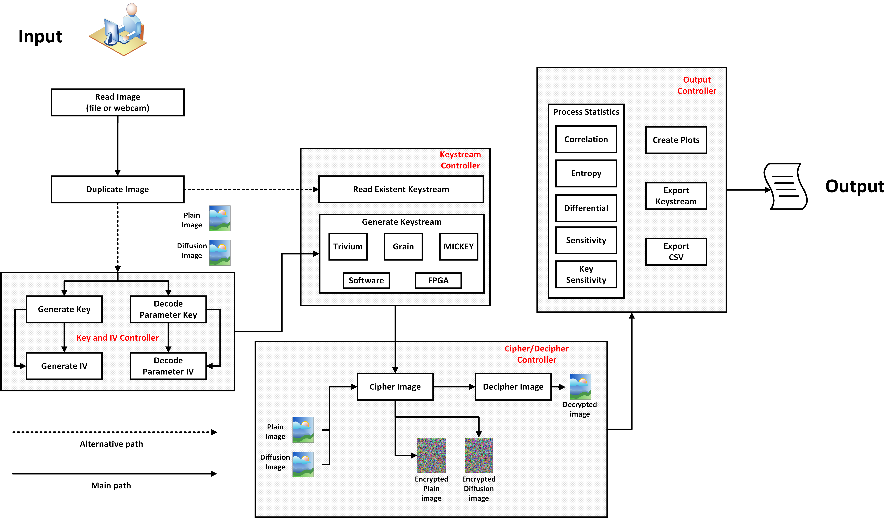
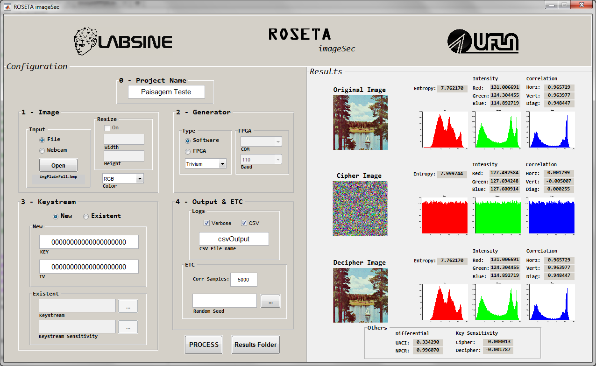

# Analysis scripts

Scripts for quality analysis of cipher systems of eSTREAM Profile II algorithms. To make the analysis process automated, scripts were
developed with the help of the Matlab tool. These scripts are capable of performing the encryption / decryption process, as well
as calculating the established metrics. The numerical results of the runs are saved in ".csv" files for further statistical synthesis.




## Folder structure

This folder is ordained as follows

* **datasets:** contains the selected images from the USC-SIPI dataset.

* **executions:** each execution of the script generates an individual folder with the results obtained.

* **scripts:** where all the auxiliary scripts are stored.

* **seeds:** contains the seeds used in the execution of the tests reported in the final master's work.

* **statistics:** contains .csv files with the values of each metric (column) for each run (line) of each encryption algorithm.

## Executing

The analysis system implemented in Matlab can be used by means of command line or by graphical interface.

### Command line

```
runAnalysis(imagePath, camIndex, resolution, resize, color, generator, baud, com, reset, keystreamFileName, keystreamSensitivityFileName, Key, IV, samples, verbose, csv, csvFileName, seedIN, name)
```

*where:*

* **imagePath:** the folder path of the image to be processed. If the user wants to capture a new image this parameter should not be informed. In this case should be used "[]" instead of the path, and so omit this parameter.

* **camIndex:** the user after run 'webcamlist' command choose what the webcam will be used by their index in 'ans' array.

* **resolution:** if "imagePath" is absent, this parameter should be a string containing the desired resolution of the webcamcapture. To view the supported resolutions, use the command 'cam.Resolution'. 

* **resize:** if this parameter aren't absent, then the image will be resized for the "resize" dimensions. Syntax - \[H W]. 

* **color:** 'gray' - if the image is RGB and the user needs to use in gray. 'rgb' - if the image is RGB and the user needs to use in RGB.

* **generator:** is a string representing the pseudo random generator to be used, that is: 'trivium' or 'triviumFPGA' or 'mickey' or 'mickeyFPGA or 'grain' or 'grainFPGA'.

* **baud:** baud rate to be used in serial communication with FPGA.

* **com:** serial COM port where FPGA is connected.

* **reset:** used in generators in hardware to indicate (1) or not (0) if it is necessary to reset in its circuits.

* **keystreamFileName:** path for an existent keystream text file composed of hexadecimal elements, represented as logical type. If was omitted, this script will generated a new one using the "generator" informed together with the "Key" and "IV" parameters.   

* **keystreamSensitivityFileName:** path for an existent keystream for sensitivity metric calculation. It's similar to a normal keystream file, but ir's generated with an 1-bit modified key value.

* **Key:** represents the key of encryption system, is represented by a string of 20 hexadecimal digits. For Key examples view: <https://goo.gl/QNjreG>

* **IV:** represents the initialization vector of encryption system,is represented by a string of 20 hexadecimal digits. For IV examples view: <https://goo.gl/QNjreG> 

* **samples:** number of pixels pair sampled in correlation analysis.

* **verbose:** (1) - if user want to view execution information on screen. (0) - otherwise.

* **csv:** (1) - if user want to save the statistics to a .csv file. (0) - otherwise.

* **csvFileName:** name of the csv file to be writed.

* **seedIN:** random seed to be used, if is empty generates a new one.

* **name:** string representing the name of the project. Is it used to create the folders structure for the output results.

*Examples:*

Using an existing image and trivium cipher running on software.
```
runAnalysis('atom.png', [], [], [], [], 'trivium', [], [], [], [], [], [], [], 5000, 1, 1, 'teste', ['seeds/seed_1.mat'], 'teste');
```

Using an existing image and MICKEY cipher running on FPGA connected on COM6 port with 230400 baud.
```
runAnalysis('7.1.10.tiff', [], [], [], [], 'mickeyFPGA', 230400, 'COM6', 1, [], [], '00000000000000000000', '00000000000000000000', 5000, 0, 0, 'teste', ['seeds/seed_1.mat'], 'teste');
```

Capturing a new image using webcam device with 640x480 pixels of resolution and mickey cipher running on software.
```
[paths, entropyOUT, intensityOUT, correlationOUT] = runAnalysis([], 1, '640x480', [], 'rgb', 'mickey', [], [], 1, [], '00000000000000000000', '00000000000000000000', 5000, 1, 1, 'teste', ['seeds/seed_1.mat'], 'teste');
```

### Graphical user interface - GUI

To use the analysis platform by means of the graphical interface, execute the 'guiPrincipal.m' file with Matlab. The most important options in the command line execution mode are present in the GUI, so the functionality of each of the parameters remains unchanged.


